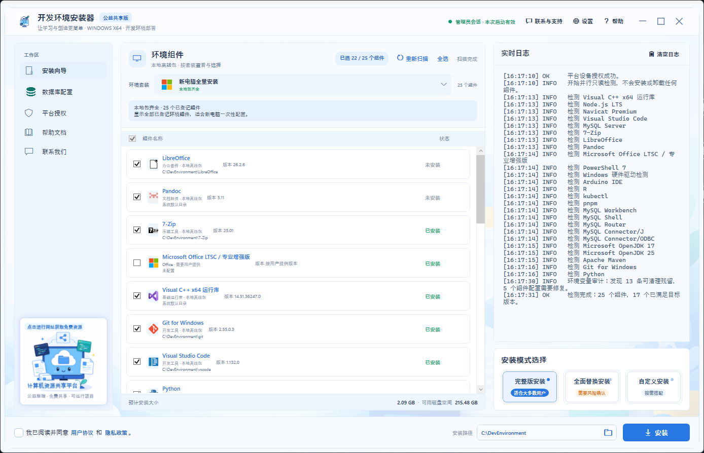

# 计算机环境自动安装器



> 计算机资源共享平台：免费共享计算机学习、开发与实践资源。  
> 计算机环境自动安装器：面向新电脑和日常使用电脑的本地环境检测、配置与离线安装工具。

**项目名称：计算机环境自动安装器**

本项目不仅服务于软件开发人员，也适合新装 Windows 系统后的电脑初始化、常用办公软件准备、数据库环境配置、编程学习、嵌入式开发和科学计算环境部署。

## 快速下载

完整网盘链接和提取码请查看同目录的纯文本文件：[DOWNLOAD-LINKS.txt](DOWNLOAD-LINKS.txt)。其中包含“需安装版”和“可直接运行版”的百度网盘、夸克网盘链接。

- **需安装版**：下载后运行 MSI 安装包，可创建桌面快捷方式。
- **可直接运行版**：解压后直接运行 EXE；要完整离线安装环境，必须保留旁边的 `config`、`engine` 和 `packages` 目录。
- **推荐**：新电脑优先下载“可直接运行程序”完整目录；只需要安装主程序时再选择 MSI。

## 项目定位

本项目将“计算机资源共享平台”和“计算机环境自动安装器”分开发布：平台用于获取资源和授权，安装器用于在 Windows 电脑上检测、安装和配置常用环境。安装器的环境安装包在制作阶段通过可用网络或代理预先下载，并在终端使用时从本地 `packages` 目录读取，不要求再次访问境外官网。

## 功能概览

- 自动扫描 Windows 环境，识别已安装版本、缺失组件、环境变量和可修复项。
- 适合新电脑初始化：一次检查系统运行库、开发工具、办公文档工具和常见辅助工具。
- 提供全面安装、全面并替换安装、自定义安装三种模式。
- 安装前校验本地包的 SHA-256，缺包或校验不一致时停止，不会改用未知来源的文件。
- 支持 MySQL Server、Workbench、Shell、Router、Connector/J、Connector/ODBC 的本地安装；替换已有 MySQL 前执行数据备份和校验。
- 支持 Node.js LTS、pnpm、JDK 17/25、Maven、Git、Python、VS Code、PowerShell、7-Zip、LibreOffice、Pandoc、Arduino IDE、R 和 kubectl 等本地包。
- 支持安装日志、错误脱敏报告、环境变量审计、平台授权和安装后重新扫描。
- 按计算机软件开发、数据库与服务、办公文档、嵌入式与硬件、科学计算及基础工具分类展示环境。
- 通过 `platform-screenshots`、`component-icons`、`contact-images` 和 `封面.png` 提供完整的产品说明素材。

## 重要的离线说明

`开发环境安装器.msi` 约 72 MB，是用于安装主程序和桌面快捷方式的轻量 MSI；它不嵌入约 2.24 GB 的第三方离线安装包。需要完全离线安装环境时，必须同时取得本发布目录中的 `config`、`engine` 和 `packages`，并保持它们与 `DevEnvironmentInstaller.exe` 的相对位置不变。

当前发布清单共有 25 个组件，其中 22 个带随包安装文件；Office LTSC 和 Navicat 仍是用户自备安装包，Windows 硬件驱动属于系统管理项，不能宣称为已随包离线安装。详细文件名、版本和 SHA-256 以 `config/packages.json` 与 `PACKAGE-SHA256SUMS.txt` 为准。

## GitHub 分发建议

GitHub 普通仓库不适合直接保存这些二进制文件：单个 Git 对象超过 100 MB 会被拒绝，Git LFS 还受账户存储和下载配额限制。推荐把 README、配置、说明图片、校验清单和源码放在仓库，把 EXE、MSI 及每个 `packages` 文件作为 GitHub Release 附件；不要把所有安装包再压成一个超过 2 GB 的文件。

如果 Release 附件的总容量或下载配额不足，应将 `packages` 放到对象存储或网盘，并在 Release 页面提供下载索引和 SHA-256。公开分发 Microsoft、MySQL、Office、Navicat 等第三方安装包前，还必须核对各软件的再分发许可；本项目不改变第三方软件的许可条款。

这是一个面向 Windows 10/11 x64 的可视化开发环境安装器。界面使用 .NET 8 WPF，系统检测和安装编排使用 Windows PowerShell 5.1 兼容脚本。正式发布 EXE 启动时会请求一次管理员授权，并在当前启动会话内复用该权限；退出后不会保留任何管理员 Token 或永久免 UAC 状态。启动后先进行只读检测；安装、SQL 导入和环境修复前，还必须通过浏览器登录计算机资源共享平台并确认当前设备授权。

## 三种安装模式

- **全面安装**：检测当前计算机，只选择尚未安装的组件。
- **全面并替换安装**：选择全部组件；对可安全识别的已安装组件执行静默卸载后安装离线包。
- **自定义安装**：由用户手动选择组件。

向导页中的安装按钮在扫描完成后可点击，以便直接显示缺少的安全条件；它仍会在执行前强制检查平台授权、用户协议、安装路径、组件选择、替换风险确认和 MySQL 凭据。切换到“全面并替换安装”后，请在安装模式卡片下方勾选替换风险确认。

## 安全边界

- 程序清单中的每个离线包在安装前都会校验 SHA-256。
- 只自动卸载 Windows“应用和功能”中可识别且提供静默卸载方式的组件。
- 不删除来源不明的便携版目录，不清理用户项目、仓库或个人文件。
- MySQL 更新、全面替换或自定义重装只要检测到现有实例，就必须先通过旧 root 密码验证并完成用户数据库逻辑备份、SHA-256 校验和数据库/表/行快照，否则不会卸载、覆盖或创建替换实例。备份包含空数据库、表、触发器、存储过程和事件，不导入旧实例的 `mysql` 系统库；备份前后快照不一致时会中止变更。
- 备份恢复完成后会再次核对用户数据库数量、表数、总行数和快照摘要；校验失败会停止流程并保留备份文件，旧服务和旧数据目录不会由安装器自动删除。
- MySQL 密码不写入安装计划、命令行或日志，只通过当前 Windows 用户的 DPAPI 临时加密文件传给 PowerShell，使用后删除。
- 所有会修改系统的操作只在用户点击“开始安装”后执行。

## 发布目录

```text
计算机环境自动安装器/
  README.md                    功能介绍、使用说明和目录
  DOWNLOAD-LINKS.txt           百度网盘、夸克网盘纯文本下载链接
  USER-GUIDE.md                用户操作指南
  config/                       组件清单和检测规则
  engine/                       检测、校验和安装引擎
  packages/                     本地离线安装包，约 2.24 GB
  component-icons/              各环境官方图标
  platform-screenshots/         平台首页和资源市场截图
  contact-images/               联系和公益支持图片
  封面.png                     计算机资源共享平台宣传封面
  DevEnvironmentInstaller.exe  可直接运行程序
  开发环境安装器.msi           Windows 安装包
```

## 构建

新版 WPF 前端源码位于 `源码/src/DevEnvironmentInstaller/`。构建脚本只编译和整理文件，不会启动安装器，也不会执行安装引擎：

```powershell
Set-Location .\源码
powershell.exe -NoProfile -ExecutionPolicy Bypass -File .\scripts\Build-OfflineInstaller.ps1
```

构建结果位于 `程序/开发环境安装器`。将整个目录复制到目标计算机，运行其中的 `DevEnvironmentInstaller.exe`。构建脚本会重建该正式发布目录。

MSI 是轻量安装包，只负责安装主程序、配置、引擎、图标和文档，并创建桌面快捷方式；它不嵌入约 2GB 级 `packages` 离线安装包，以避免 Windows Installer 缓存超大 MSI 时出现 110/1310 错误。需要完全离线安装环境时，应使用同目录的完整 `开发环境安装器` 发布目录运行 EXE，或将该目录中的 `packages` 复制到 MSI 安装后的程序目录。

右侧“本地安装路径”可设置安装器管理的便携环境根目录。应用或开始安装前会创建该目录，并用临时文件验证实际可写性；不可创建或不可写时会给出明确原因。Maven、pnpm、Connector/J 等压缩包环境会使用该目录；厂商 MSI/EXE 若不提供自定义目标参数，仍遵循厂商默认安装位置。组件行的“打开”按钮可直接打开已检测到的环境目录。

“环境变量审计”会同时检查机器级和用户级 Path、`JAVA_HOME`、`MAVEN_HOME` 及 Connector/J 变量，标记旧版本入口和失效目录。点击“修复”前会确认，修复会清理已识别残留并写入当前清单对应配置；完成后请重新打开 CMD 或 PowerShell。

“MySQL 数据导入”支持选择 `.sql` 文件并输入数据库名。数据库不存在时会自动创建，再使用现有 root 密码导入；数据库名只允许字母、数字和下划线，密码通过 DPAPI 临时文件传递。

`程序/开发环境安装器/DevEnvironmentInstaller.exe` 是当前唯一正式版蓝色工作台风格 WPF 界面。安装时会显示总体百分比、当前组件、当前阶段和逐组件进度列表；阶段包括安全校验、执行安装程序、刷新环境配置和安装后验证。

首次启动会弹出平台设备授权窗口。点击“打开平台并登录授权”后，浏览器会进入 [计算机资源共享平台](http://47.114.72.23/)。已登录用户可直接确认本次设备授权；未登录用户先完成登录或注册，再返回授权页确认。安装器只保存一次性申请标识，并且每次启动都会向平台复核授权状态；不会读取浏览器密码、Cookie 或授权密钥。未授权时可查看检测结果，但不能执行安装、SQL 导入或环境修复。

启动后会自动打开完整指南，左侧目录覆盖启动、三种安装方式、MySQL、环境变量、安全、恢复、网盘交付和支持等主题；顶部“帮助”按钮可随时再次打开。中间功能区还提供“程序开发需求”和“公益赞助”，分别展示三张联系图片和两张赞助二维码；图片位于 EXE 旁的 `contact-images` 文件夹。

发布版本采用左/中/右三列工作区布局。`config`、`engine` 和 `packages` 作为本地资源放在 EXE 旁边，不嵌入单文件，因此当前发布 EXE 约 64.8 MB，启动解包开销较低。

## 默认安装范围

- Microsoft Visual C++ 2015-2022 x64 运行库
- MySQL Server、Workbench、Shell、Router、Connector/J、Connector/ODBC
- Node.js LTS、pnpm
- Microsoft Build of OpenJDK 17/25、Apache Maven
- Git for Windows、Python、Visual Studio Code

安装向导将组件按开发、基础运行、办公文档、软硬件驱动、数据库、嵌入式、移动端、云原生、多媒体和科学计算等套装组织，并在同一个组件列表中显示。没有合法本地安装包的 Office、驱动、Docker、Android Studio 等项目只显示为待补充，不会伪装成可离线安装项。

JDK 25 默认设置为 `JAVA_HOME`；JDK 17 同时安装并可在设置中心切换为默认版本。安装器兼容 `17`、`25` 以及类似 `25.0.4.7` 的完整 MSI 版本号。

这里的“MySQL 全量”指当前 Windows 开发和部署常用的官方核心生态，不包含已停止维护或非运行必需的 MySQL Notifier、旧版 MySQL Installer、离线帮助文档、示例库，以及面向其他语言的全部 Connector。需要这些少数专项组件时，应在自定义清单中单独增加并锁定官方哈希。

## 代码签名

当前构建未附带商业代码签名证书。首次运行时 Windows 可能显示 SmartScreen 提示。正式对外分发前，建议使用组织的 Authenticode 证书签署 EXE 和 PowerShell 脚本，并将发布哈希与证书指纹一同公布。

## 商用验证状态

本交付目录附带 `COMMERCIAL-READINESS-REPORT.md`。当前已完成离线包哈希、清单结构、MSI 元数据、第三方签名、引擎回归、GUI 烟测、当前已安装环境运行时烟测和只读检测；真实管理员安装/卸载、MySQL 数据迁移与失败回滚仍需在干净 Windows 10/11 x64 管理员环境完成。报告中的阻塞项关闭前，本版本只应作为内部测试或修复后候选使用。
